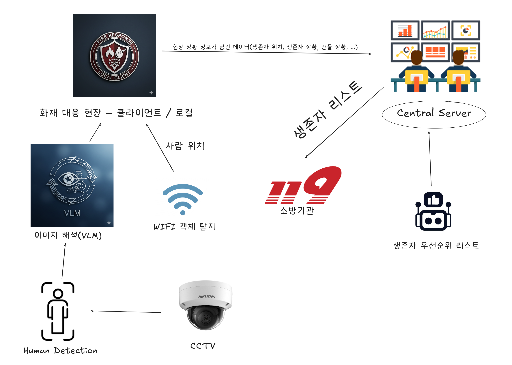

# Architecture



## Model Benchmark

⏱️ **Benchmark Result (1000 runs)**

| Metric             | Value     |
| ------------------ | --------- |
| Avg Inference Time | 26.61 ms  | 
| Estimated FPS      | 37.58 FPS |
| Avg CPU Usage      | 99.895 %  |
| Avg RAM Usage      | 154.31 MB |


## Human, Fire, Smoke Detection Test API

## predict

```sh

curl -X POST "http://<server-ip>:<port>/predict?conf_threshold=0.5" \
  -F "file=@human_cctv.png"
```
Returns

```json
{
  "image_path": "predicted_img.jpg",
  "detections": [
    {
      "class": "fire",
      "confidence": 0.92,
      "box": { "x1": 250, "y1": 200, "x2": 400, "y2": 350 }
    },
    {
      "class": "human",
      "confidence": 0.87,
      "box": { "x1": 100, "y1": 150, "x2": 200, "y2": 300 }
    },
    {
      "class": "smoke",
      "confidence": 0.78,
      "box": { "x1": 50, "y1": 220, "x2": 180, "y2": 350 }
    }
  ],
  "summary": {
    "fire_count": 1,
    "human_count": 1,
    "smoke_count": 1,
    "total_objects": 3
  }
}
```

## predic_image

```sh
curl -X POST "http://<server-ip>:<port>/predict_image" \
  -F "file=@human_cctv.png" \
  --output output.jpg
```


Returns

```sh
image
```

## FastAPI -> WebUI

[webui](http://49.142.15.26:5557/docs#/default/predict_image_predict_image_post)


Click Try it out -> Choose File -> Execute


